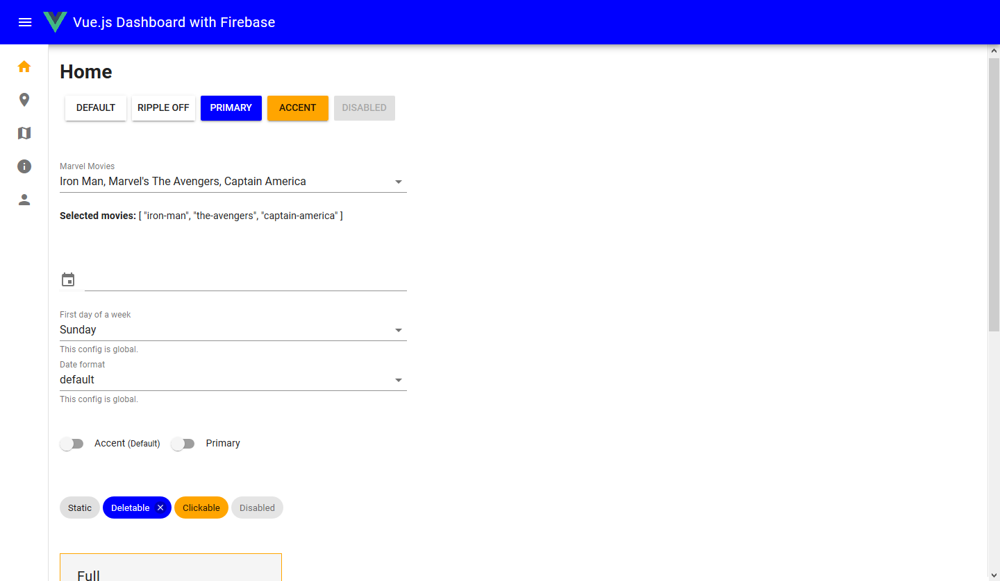
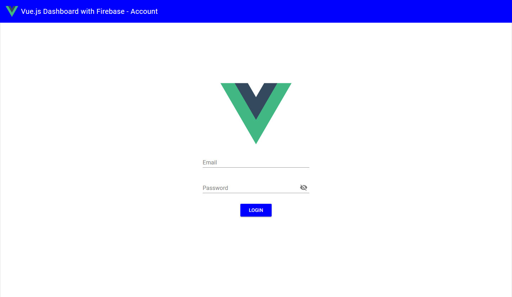
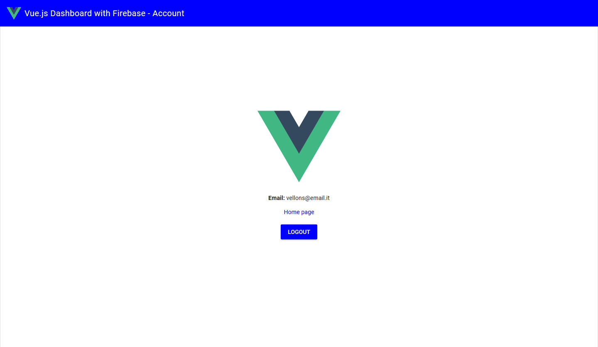

# vuejs-firebase-auth-base-dashboard-with-vue-material

A basic [Vue.js](https://vuejs.org/) dashboard template integrated with [Firebase Auth](https://firebase.google.com/docs/auth) and build with [Vue Material](https://vuematerial.io/).
<br>This dashboard has **protected pages** accessible only after user login.
<br>You can also choose between light or dark **theme** through a switch


## Integration with your Firebase

This dashboard is fully integrated with Firebase Auth.
You only need to [register a new web application](https://firebase.google.com/docs/web/setup) inside your Firebase project.
Remember that you need to enable [Email/Password](https://firebase.google.com/docs/auth/web/password-auth) sign-in inside the Firebase console in the Auth section.

After that, copy your Firebase SDK configuration inside ```src/firebase/credentials.js```
<br>Or make ```.env``` secret file inside the project root and copy your credentials like that:
```js
VUE_APP_FIREBASE_API_KEY=api-key
VUE_APP_FIREBASE_AUTH_DOMAIN=project-id.firebaseapp.com
VUE_APP_FIREBASE_DB_URL=https://project-id.firebaseio.com
VUE_APP_FIREBASE_PROJECT_ID=project-id
VUE_APP_FIREBASE_STORAGE_BUCKET=project-id.appspot.com
VUE_APP_FIREBASE_MESSAGING_SENDER_ID=sender-id
VUE_APP_FIREBASE_APP_ID=app-id
```

<div>


</div>

## Extend project
To add other Firebase module in you project open ```src/firebase/index.js``` file, add the module that you need and export modules like FirebaseAuth.
```js
import firebase from 'firebase/app';
import 'firebase/auth';

import firebaseCredentials from './credentials';
firebase.initializeApp(firebaseCredentials.config);

const FirebaseAuth = firebase.auth();

export {
    FirebaseAuth
}
```

To import in yours Vue module use:
```js
import {FirebaseAuth} from "your-path/firebase";
```

## Project setup
You need [node](https://nodejs.org) to build and run this application.
<br>To install all dependencies run in your terminal this command:
```
npm install
```

### Compiles and hot-reloads for development
```
npm run serve
```

### Compiles and minifies for production
```
npm run build
```

### Lints and fixes files
```
npm run lint
```

### Customize configuration
See [Configuration Reference](https://cli.vuejs.org/config/).
